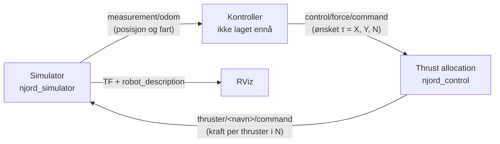

# NJORD – simulator og thrust allocation for Munin

ROS 2-pakker for å simulere Njords båt **Munin** og fordele krefter til de fire thrusterne.
Simulatoren viser båten i RViz, og thrust allocation bruker [skadipy](https://github.com/incebellipipo/skadipy) med pseudoinvers.

Fungerer med **ROS 2 Jazzy** (Ubuntu 24.04) og **ROS 2 Humble** (Ubuntu 22.04).



Samme kontroller og thrust allocation skal kunne brukes på den ekte båten. Der byttes simulatoren ut med en node som gjør kraft om til turtall/PWM for motorene.

---

## Innhold

- [Hva ligger hvor](#hva-ligger-hvor)
- [Installasjon](#installasjon)
- [Kjøre](#kjøre)
- [Topics](#topics)
- [Hvordan simulatoren er bygget](#hvordan-simulatoren-er-bygget)
- [Thrust allocation og skadipy](#thrust-allocation-og-skadipy)
- [Endre Munin – hva og hvor](#endre-munin--hva-og-hvor)
- [Koordinatsystemer](#koordinatsystemer)
- [Opphav og lisens](#opphav-og-lisens)

---

## Hva ligger hvor

```
NJORD/
├── requirements.txt                  Python-pakker som ikke finnes i ROS (skadipy, shoeboxpy)
├── njord_simulator/                  Simulatoren
│   ├── njord_simulator/
│   │   ├── base.py                   Felles simulatorlogikk (tid, odometri, TF, reset)
│   │   └── munin.py                  Munin: skrog, masse, GM og thrustere  ← endres oftest
│   ├── urdf/munin.urdf.xacro         3D-modell og thrusterplassering for RViz
│   ├── meshes/munin/
│   │   └── munin_simple.stl          Forenklet modell som RViz bruker (~0,7 MB)
│   ├── config/simulation.yaml        Startposisjon og startfart
│   ├── rviz/munin.rviz               RViz-oppsett
│   └── launch/munin.launch.py        Starter simulator + robot_state_publisher + RViz
└── njord_control/                    Kontrollsystemet
    ├── njord_control/
    │   └── thrust_allocation.py      Thrust allocation med skadipy
    └── launch/thrust_allocation.launch.py
```

---

## Installasjon

### 1. Forutsetninger

ROS 2 Jazzy eller Humble må være installert (`/opt/ros/<distro>`), og du trenger et colcon-workspace, for eksempel `~/ros_ws`.

```bash
sudo apt install python3-pip python3-venv python3-colcon-common-extensions python3-rosdep git
```

### 2. Last ned

```bash
mkdir -p ~/ros_ws/src
cd ~/ros_ws/src
git clone <REPO-URL> NJORD
```

### 3. Python-pakker (skadipy og shoeboxpy)

Disse finnes ikke som ROS-pakker og må installeres med pip.

**Jazzy (Ubuntu 24.04)** – Ubuntu 24.04 tillater ikke `pip install` rett i systemet, så vi bruker en venv.
`--system-site-packages` gjør at venv-en fortsatt ser ROS sine Python-pakker (`rclpy` osv.).

```bash
cd ~/ros_ws
python3 -m venv --system-site-packages venv
source venv/bin/activate
pip install -r src/NJORD/requirements.txt
```

**Humble (Ubuntu 22.04)** – her kan du installere direkte:

```bash
pip install --user -r ~/ros_ws/src/NJORD/requirements.txt
```

(Venv som over fungerer også på Humble, hvis du heller vil det.)

### 4. ROS-avhengigheter og bygging

```bash
source /opt/ros/<distro>/setup.bash          # jazzy eller humble
cd ~/ros_ws
sudo rosdep init                              # bare første gang på maskinen
rosdep update
rosdep install --from-paths src/NJORD --ignore-src -y
colcon build --packages-select njord_simulator njord_control
```

### 5. Sourcing i hver ny terminal

```bash
source /opt/ros/<distro>/setup.bash
source ~/ros_ws/venv/bin/activate             # bare hvis du bruker venv (Jazzy)
source ~/ros_ws/install/setup.bash
```

Tips: legg linjene i `~/.bashrc`, så slipper du å skrive dem hver gang.

> **Husk å bygge på nytt** (`colcon build ...`) etter at du har endret filer, ellers bruker ROS den gamle versjonen.
> Bygger du med `colcon build --symlink-install`, trenger du ikke bygge på nytt etter endringer i Python-filer.

---

## Kjøre

**Simulator med RViz:**

```bash
ros2 launch njord_simulator munin.launch.py
```

Uten RViz: `ros2 launch njord_simulator munin.launch.py use_gui:=false`

**Thrust allocation** (i en ny terminal):

```bash
ros2 launch njord_control thrust_allocation.launch.py
```

**Test uten kontroller** – send en ønsket kraft τ for hånd (i en tredje terminal):

```bash
# Kjør fremover med 0,5 N
ros2 topic pub -r 10 /munin/control/force/command geometry_msgs/msg/Wrench "{force: {x: 0.5}}"

# Sideveis mot styrbord
ros2 topic pub -r 10 /munin/control/force/command geometry_msgs/msg/Wrench "{force: {y: 0.5}}"

# Snu på stedet
ros2 topic pub -r 10 /munin/control/force/command geometry_msgs/msg/Wrench "{torque: {z: 0.1}}"
```

**Styre én thruster direkte** (uten thrust allocation):

```bash
ros2 topic pub -r 10 /munin/thruster/fore_port/command geometry_msgs/msg/Wrench "{force: {x: 1.0}}"
```

**Sette båten tilbake til start:**

```bash
ros2 service call /munin/simulator/reset std_srvs/srv/Empty
```

---

## Topics

Alt ligger under namespace `/munin`.

### Kontroller (skal lages)

| | Topic | Type | Innhold |
|---|---|---|---|
| Subscribe | `measurement/odom` | `nav_msgs/Odometry` | Posisjon, kurs og fart |
| Publish | `control/force/command` | `geometry_msgs/Wrench` | `force.x` = X [N], `force.y` = Y [N], `torque.z` = N [Nm] |

### Thrust allocation – `njord_control`

| | Topic | Type | Innhold |
|---|---|---|---|
| Subscribe | `control/force/command` | `geometry_msgs/Wrench` | Ønsket τ |
| Publish | `thruster/fore_port/command` | `geometry_msgs/Wrench` | `force.x` = kraft [N] |
| | `thruster/fore_starboard/command` | `geometry_msgs/Wrench` | ″ |
| | `thruster/aft_port/command` | `geometry_msgs/Wrench` | ″ |
| | `thruster/aft_starboard/command` | `geometry_msgs/Wrench` | ″ |

### Simulator – `njord_simulator`

| | Topic | Type | Innhold |
|---|---|---|---|
| Subscribe | `thruster/<navn>/command` | `geometry_msgs/Wrench` | Kraft per thruster, begrenset til ±1 N |
| Publish | `measurement/odom` | `nav_msgs/Odometry` | Posisjon og fart |
| | `measurement/pose` | `geometry_msgs/PoseWithCovarianceStamped` | Bare posisjon |
| | `thruster/<navn>/issued` | `geometry_msgs/WrenchStamped` | Kraften som faktisk ble brukt |
| | `/clock` | `rosgraph_msgs/Clock` | Simuleringstid |
| | `/tf` | | `world → munin/base_link_ned` |
| Service | `simulator/reset` | `std_srvs/Empty` | Tilbake til startposisjon |

### Lese `measurement/odom` i en kontroller

- `pose.pose.position.x`, `.y` – posisjon i `world` [m] (x = nord, y = øst)
- `pose.pose.orientation` – kurs som kvaternion:
  ```python
  from scipy.spatial.transform import Rotation as R
  q = msg.pose.pose.orientation
  psi = R.from_quat([q.x, q.y, q.z, q.w]).as_euler("xyz")[2]
  ```
- `twist.twist.linear.x`, `.y`, `angular.z` – u, v, r (fart i båtens egen ramme)

Dette er η = [x, y, ψ] og ν = [u, v, r].

---

## Hvordan simulatoren er bygget

Simulatoren er basert på `cybership_simulator` fra NTNU-MCS, og består av tre deler:

**1. `base.py` – felles motor (trenger normalt ikke endres)**

Kjører en løkke hvert 0,01 s:

1. Regner ut total kraft på båten: `τ = B · u`, der `u` er kraften fra hver thruster og `B` er konfigurasjonsmatrisen (hvor thrusterne sitter og hvilken vei de peker).
2. Tar et tidssteg i båtmodellen (`vessel.step`).
3. Publiserer odometri, TF og simuleringstid.

**2. `munin.py` – alt som er spesielt for Munin**

Arver fra `base.py` og fyller inn tre ting:

- `_create_vessel()` – båtmodellen. Bruker [shoeboxpy](https://github.com/incebellipipo/shoeboxpy), som modellerer båten som en «skoeske»: masse, tillagt masse og lineær dempning regnes ut fra L, B og T.
- `_init_allocator()` – de fire thrusterne som `skadipy.actuator.Fixed` med posisjon og retning. Brukes her bare til å lage B-matrisen.
- `setup_thrusters()` – én subscriber per thruster på `thruster/<navn>/command`. Kraften begrenses til ±1 N, og kommandoer under 0,05 N regnes som 0.

**3. URDF + launch – visning i RViz**

- `munin.urdf.xacro` beskriver 3D-modellen og hvor thrusterne sitter.
- `robot_state_publisher` publiserer dette som TF, og RViz tegner båten der simulatoren sier den er.
- `munin.launch.py` starter alt samtidig.

### Om båtmodellen

Shoebox regner massen som `ρ · L · B · T`. Munin er en katamaran, så å bruke de ekte målene (1,0 × 0,886 × 0,26 m) ville gitt ~230 kg. Derfor bruker `munin.py` Voyager sin «boks» (1,0 × 0,3 × 0,08 m) og skalerer masse og dempning opp med `MASS_DAMPING_SCALE = 1.2` (≈ 29 kg). Dette er et grovt anslag som bør justeres når vi vet mer om båten.

---

## Thrust allocation og skadipy

Kontrolleren sier *hva* båten skal gjøre (τ = X, Y, N). Thrust allocation bestemmer *hvordan* de fire thrusterne skal fordele jobben.

### B-matrisen

Hver thruster gir et bidrag til X, Y og N ut fra hvor den sitter (x, y) og hvilken vei den peker (α):

```
X =  cos(α) · F
Y =  sin(α) · F
N = (x · sin(α) − y · cos(α)) · F
```

Samlet for alle fire: `τ = B · f`, der `f` er kraften fra hver thruster. Simulatoren bruker dette «forover» (f → τ). Thrust allocation bruker det «baklengs»: gitt ønsket τ, finn f.

### Pseudoinvers

Det finnes uendelig mange kombinasjoner av fire krefter som gir samme τ (4 thrustere, 3 frihetsgrader). Pseudoinversen `f = B⁺ · τ` velger den med **minst total kraft** (minste ‖f‖²).

### Slik brukes skadipy (`njord_control/thrust_allocation.py`)

```python
# 1. Beskriv thrusterne
actuators = [
    skadipy.actuator.Fixed(
        position=skadipy.toolbox.Point([x, y, 0.0]),
        orientation=skadipy.toolbox.Quaternion(axis=(0.0, 0.0, 1.0), radians=alpha),
    )
    for (x, y), alpha in THRUSTERS.values()
]

# 2. Hvilke frihetsgrader vi styrer: surge, sway og gir
dofs = [ForceTorqueComponent.X, ForceTorqueComponent.Y, ForceTorqueComponent.N]

# 3. Metode, og bygg B-matrisen
allocator = skadipy.allocator.PseudoInverse(actuators=actuators, force_torque_components=dofs)
allocator.compute_configuration_matrix()

# 4. For hver τ fra kontrolleren
allocator.allocate(tau=tau)                          # tau er 6x1: [X, Y, Z, K, M, N]
forces = [a.force[0] for a in actuators]             # kraft per thruster i N
```

### Metning

Pseudoinversen vet ikke at thrusterne har en maks kraft. Hvis én thruster ville fått mer enn `max_thrust` (1 N), skaleres **alle fire ned like mye**. Da beholdes retningen på τ – båten gjør det samme, bare svakere. (Klipper man hver thruster for seg, kan for eksempel «kjør rett frem» plutselig bli til giring.)

### Eksempel

| Ønsket τ | fore_port | fore_starboard | aft_port | aft_starboard |
|---|---|---|---|---|
| X = 1 N (fremover) | +0,33 | +0,33 | −0,33 | −0,33 |
| Y = 1 N (styrbord) | −0,04 | +0,04 | −0,73 | +0,73 |
| N = 0,1 Nm (gir) | +0,63 | −0,63 | −0,63 | +0,63 |

Negativ kraft betyr at thrusteren går i revers.

---

## Endre Munin – hva og hvor

| Hva | Fil | Hva du endrer |
|---|---|---|
| Masse og dempning | `njord_simulator/njord_simulator/munin.py` | `MASS_DAMPING_SCALE` (og ev. `VOYAGER_L/B/T`) |
| Stabilitet (GM) | `munin.py` | `GM_PHI` (rull), `GM_THETA` (stamp) |
| Maks kraft i simulatoren | `munin.py` | `THRUST_LIMIT` |
| Maks kraft i thrust allocation | `njord_control/launch/thrust_allocation.launch.py` | parameteren `max_thrust` |
| Startposisjon / startfart | `njord_simulator/config/simulation.yaml` | `initial_conditions` |
| 3D-modell | `njord_simulator/urdf/munin.urdf.xacro` | filnavn og `scale` under `<mesh>` (STL i mm → `0.001`) |
| **Thrusterposisjon og vinkel** | **tre steder, se under** | |

### Thrusterne står tre steder – må endres likt

| Fil | Hva |
|---|---|
| `njord_simulator/njord_simulator/munin.py` | `THRUSTER_ANGLE` og `THRUSTERS` |
| `njord_simulator/urdf/munin.urdf.xacro` | `thruster_angle` og `origin_xyz` for hver thruster |
| `njord_control/njord_control/thrust_allocation.py` | `THRUSTER_ANGLE` og `THRUSTERS` |

Nå: fire faste thrustere, én i hver ende av hver pontong, som peker **40° utover** fra lengderetningen.

| Thruster | x [m] | y [m] | Retning |
|---|---|---|---|
| `fore_port` | 0,276 | −0,330 | −40° (forover-babord) |
| `fore_starboard` | 0,276 | 0,330 | +40° (forover-styrbord) |
| `aft_port` | −0,379 | −0,324 | −140° (akterover-babord) |
| `aft_starboard` | −0,379 | 0,324 | +140° (akterover-styrbord) |

Posisjonene er målt fra STL-modellen. Vinkelen er et anslag.

> **Pass på vinkelen:** Thrusterne sitter nesten i et kvadrat. Står de nøyaktig 45°, peker alle kraftlinjene gjennom samme punkt, og båten kan **ikke** snu på stedet. Jo mindre vinkel (mer langs båten), jo mer girmoment.

Bygg på nytt etter endringer: `colcon build --packages-select njord_simulator njord_control`.

---

## Koordinatsystemer

Simulatoren og thrust allocation bruker **NED** (North-East-Down), som er vanlig i marin teknikk:

- **Båtens ramme** (`base_link_ned`): x forover, y mot styrbord, z nedover. Positiv gir (N, r) er med klokka sett ovenfra.
- **Verden** (`world`): x nord, y øst, z ned.

RViz bruker ROS-standarden (z opp). Derfor finnes også `base_link` (x forover, y babord, z opp), som 3D-modellen henger på. RViz-visningen er satt opp med «Invert Z Axis» så båten vises riktig vei.

---

## Opphav og lisens

Simulatoren er bygget på [`cybership_simulator`](https://github.com/NTNU-MCS/cybership_software_suite) fra NTNU-MCS (`base.py` er uendret bortsett fra en feilretting i reset, `munin.py` er basert på `voyager.py`). Prosjektet er derfor lisensiert under **GPL-3.0**, se `LICENSE` i hver pakke.

Avhengigheter: [skadipy](https://github.com/incebellipipo/skadipy) (thrust allocation) og [shoeboxpy](https://github.com/incebellipipo/shoeboxpy) (båtmodell).
